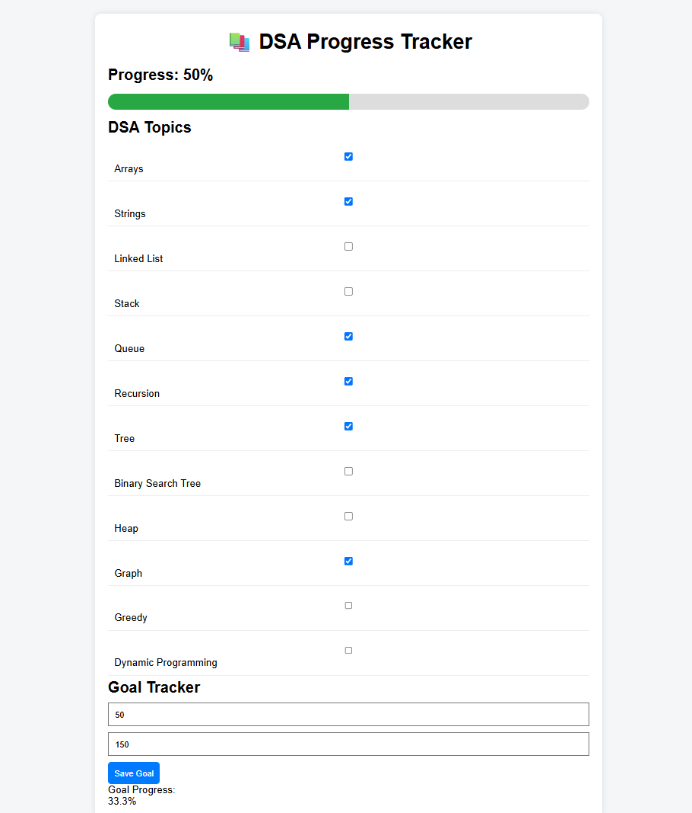

# 📚 DSA Progress Tracker


A responsive web application that helps learners track their progress in **Data Structures and Algorithms (DSA)**. Users can monitor completed topics, set coding goals, visualize progress, and maintain consistency in their DSA preparation journey.

---

## 🚀 Live Demo

🔗 Add your deployed link here

```text
https://your-demo-link.vercel.app
```

---

## 📸 Preview

Add a screenshot inside the assets folder and update the path below.

```text
assets/screenshot.png
```

Example:

```markdown

```

---

## ✨ Features

- ✅ Track completed DSA topics
- ✅ Interactive progress dashboard
- ✅ Dynamic progress bar
- ✅ Goal setting for solved questions
- ✅ Local Storage persistence
- ✅ Beginner-friendly interface
- ✅ Responsive design

---

## 🛠️ Tech Stack

### Frontend

- HTML5
- CSS3
- JavaScript (ES6)

### Storage

- Browser Local Storage API

### Version Control

- Git
- GitHub

---

## 📂 Project Structure

```bash
dsa-progress-tracker/
│
├── index.html
├── style.css
├── script.js
├── README.md
├── .gitignore
│
└── assets/
    └── screenshot.png
```

---

## 🎯 DSA Topics Covered

- Arrays
- Strings
- Linked Lists
- Stack
- Queue
- Recursion
- Trees
- Binary Search Trees
- Heap
- Graphs
- Greedy Algorithms
- Dynamic Programming

---

## ⚙️ Installation

Clone the repository

```bash
git clone https://github.com/your-username/dsa-progress-tracker.git
```

Navigate into the project

```bash
cd dsa-progress-tracker
```

Run the application

```bash
Open index.html in your browser
```

---

## 📈 Future Enhancements

- User Authentication
- Dark Mode
- Daily Streak Tracking
- Progress Analytics
- Notes & Revision Section
- Coding Platform Integration
- Leaderboard System
- Export Progress Reports

---

## 🧠 Learning Outcomes

This project demonstrates:

- DOM Manipulation
- Event Handling
- Local Storage Usage
- Responsive Web Design
- JavaScript Fundamentals
- State Management in Frontend Applications

---

## 🤝 Contributing

Contributions are welcome.

1. Fork the repository
2. Create a feature branch

```bash
git checkout -b feature-name
```

3. Commit your changes

```bash
git commit -m "Added new feature"
```

4. Push to the branch

```bash
git push origin feature-name
```

5. Open a Pull Request

---

## 📄 License

This project is licensed under the MIT License.

---

## 👨‍💻 Author

**Rose Sharma**

- GitHub: https://github.com/your-github-username
- LinkedIn: https://linkedin.com/in/your-linkedin-profile

---

⭐ If you found this project useful, consider giving it a star.
